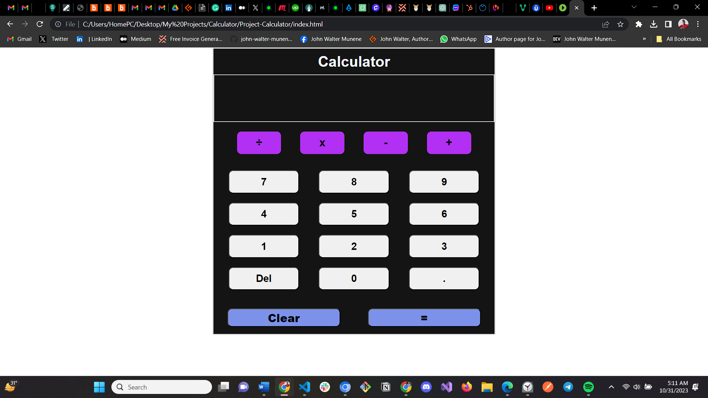

# Project-Calculator

This project is part of The Odin Project Curriculum and sums all the basics of JavaScript to build a functional calculator. 

For this calc: 
- You can chain operations and they'll be executed in order.
- You can use the Del Button to undo wron inputs. 
- You can use the clear button to refresh everything and start new operations.
- Dividing by a zero will cause an error and clear up the calculator.

                Enjoy your personal calculator!
